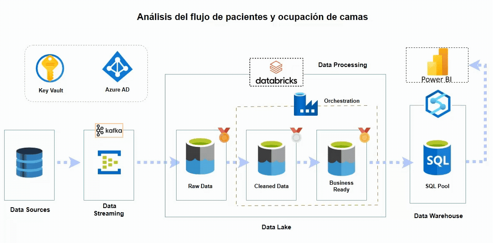

# Real-Time Analisis del flujo de pacientes en Azure


---

## 📑 Table de contenido
- [📌 Descripción general del proyecto](#-project-overview)
- [🎯 Objetivos](#-objetivos)
- [📂 Estructura del Proyecto](#-estructura-del-proyecto)
- [🛠️ Tools & Technologies](#️-tools--technologies)
- [📐 Data Architecture](#-data-architecture)
- [⭐ Star Schema Design](#-star-schema-design)
- [⚙️ Step-by-Step Implementation](#️-step-by-step-implementation)
  - [1. Event Hub Setup](#1-event-hub-setup)
  - [2. Data Simulation](#2-data-simulation)
  - [3. Storage Setup](#3-storage-setup)
  - [4. Databricks Processing](#4-databricks-processing)
  - [5. Synapse SQL Pool](#5-synapse-sql-pool)
  - [6. Version Control](#6-version-control)
- [📊 Data Analytics](#-data-analytics)
- [✅ Key Outcomes](#-key-outcomes)
- [📜 License](#-license)

---

## 📌 Descripción general del proyecto
Este proyecto demuestra un flujo de datos en tiempo real para el sector salud, diseñado para analizar el flujo de pacientes entre los departamentos de un hospital mediante los servicios en la nube de Azure.

El flujo ingiere datos en streaming, los procesa en **Databricks (PySpark)** y los almacena en **Azure Synapse SQL Pool** para su análisis y visualización.

Parte 1 – Ingeniería de datos: Creación del flujo de datos de ingesta y transformación en tiempo real. 
Parte 2 – Análisis: Conexión de Synapse con Power BI y diseño de un panel interactivo para los indicadores clave de rendimiento (KPI) del hospital.


## Pipeline




---

## 🎯 Objetivos
- Recopilar datos de pacientes en tiempo real mediante **Azure Event Hub**.
- Procesar y depurar datos con **Databricks** (Bronce → Plata → Oro).
- Implementar un **esquema de estrella** en **Synapse SQL Pool** para realizar consultas de forma eficiente.
- Habilitar el **control de versiones** con Git.

---

## 📂 Estructura del Proyecto
```plaintext
real-time-patient-flow-azure/
│
├── databricks-notebooks/  # Transformation notebooks
│   ├── 01_bronze_rawdata.py
│   ├── 02_silver_cleandata.py
│   └── 03_gold_transform.py
├── simulator/             # Data simulation scripts
│   └── patient_flow_generator.py
├── sqlpool-quries/        # SQL scripts for Synapse
│   └── SQL_pool_quries.sql
├── git_commands/                  # Git Commands
└── README.md              # Project documentation
```

---

## 🛠️ Herramientas y tecnologías
- **Azure Event Hub** – Ingesta de datos en tiempo real
- **Azure Databricks** – Procesamiento ETL basado en PySpark
- **Azure Data Lake Storage** – Almacenamiento provisional de datos sin procesar y procesados
- **Azure Synapse SQL Pool** – Almacén de datos para análisis
- **Power BI** – Creación de paneles
- **Python 3.11+** – Lenguaje de Progamación
- **Git** – Control de versiones

---

## 📐 Arquitectura de datos
El proceso sigue una **arquitectura multicapa**:
- **Bronze Layer**: Datos JSON sin procesar del Event Hub almacenados en ADLS.
- **Silver Layer**: Datos limpios y estructurados (tipos validados, manejo de valores nulos).
- **Gold Layer**: Datos agregados y transformados listos para su uso en inteligencia empresarial.

---

## ⭐ Diseño de esquema de estrella
Los datos de **Gold Layer** en Synapse siguen un **esquema de estrella** para un análisis optimizado:
- **Fact Table**: `FactPatientFlow` (visitas de pacientes, registros de tiempo, tiempos de espera, altas)
- **Dimension Tables**:
  - `DimDepartment` – Detalles del departamento
  - `DimPatient` – Información demográfica del paciente
  - `DimTime` – Dimensión de fecha y hora

---

## ⚙️ Step-by-Step Implementation

### **1. Event Hub Setup**
- Se crearon el **espacio de nombres Event Hub** y el **centro de flujo de pacientes**.
- Se configuraron los **grupos de consumidores** para la transmisión de Databricks.

---

### **2. Data Simulation**
- Desarrollé el **script de Python** `patient_flow_generator.py` para transmitir datos ficticios de pacientes (departamentos, tiempo de espera, estado de alta) a Event Hub.
- [Producer Code](simulator/patient_flow_generator.py)

---

### **3. Storage Setup**
- Almacenamiento tipo **Azure Data Lake Storage (ADLS Gen2)**.
- Creé contenedores para capas de **bronze**, **silver**, and **gold**.

---

### **4. Databricks Processing**
- [**Notebook 1**](databricks-notebooks/01_bronze_rawdata.py): Lee la transmisión del Event Hub en Bronze.
- [**Notebook 2**](databricks-notebooks/02_silver_cleandata.py): Limpia y valida el esquema..
- [**Notebook 3** ](databricks-notebooks/03_gold_transform.py): Agrega y prepara tablas de esquema de estrella..

---

### **5. Synapse SQL Pool**
- Se ha creado un **grupo SQL dedicado**.
- Se ejecutaron consultas de creación de esquemas y hechos/dimensiones desde:
  - [DDL_Qureis](sqlpool-quries/SQL_pool_quries.sql)

---

### **6. Version Control**
- Control de versiones con **Git**:
  - [Commands reference](git_commands/git_bash)

---

## 📊 Data Analytics

Una vez establecido el **canal de datos** e implementado un **esquema de estrella** en Synapse SQL Pool, el siguiente paso fue crear un **panel interactivo en Power BI**.

### **🔗 Synapse → Power BI Connection**
- Se conectó el **Grupo de SQL de Azure Synapse** a Power BI mediante una conexión SQL directa.
- Se importaron las tablas **FactPatientFlow** y **Dimensiones**. 
- Se establecieron las relaciones para la generación de informes basados ​​en el **Esquema de estrella**.  

### **📈 Funciones del panel de control**
El **Panel de Flujo de Pacientes en el Sector Salud** proporciona información sobre:  
- **Tasa de Ocupación de Camas** por departamento y sexo. 
- **Tendencias del Flujo de Pacientes** (ingresos, tiempos de espera).
- **Indicadores Clave de Desempeño (KPI) a Nivel de Departamento** (duración de la estancia, total de pacientes).
- **Filtros y Segmentadores Interactivos** por sexo.


---

## ✅ Resultados clave
- **Proceso integral:** Desde la **ingesta en tiempo real → transformación → almacenamiento → análisis**.
- **Arquitectura escalable:** Fácilmente adaptable a diferentes conjuntos de datos hospitalarios. 
- **Información empresarial:** Los administradores hospitalarios pueden monitorear **la ocupación de camas, el flujo de pacientes y la eficiencia de los departamentos** en tiempo real.
- **Valor para el portafolio:** Demuestra habilidades tanto de **ingeniería de datos** como de **análisis** en un solo proyecto.

---

**Autor**: *Hector Adrian Cardenas Camacho* 

**LinkedIn**: [Hector Adrian Cardenas](www.linkedin.com/in/hector-cardenas-camacho-197101169) 

**Contacto**: [adriancardenasc19@gmail.com](mailto:adriancardenasc19@gmail.com)
